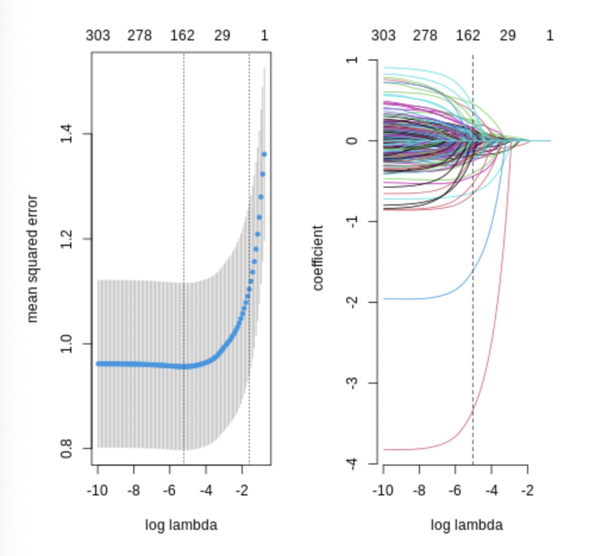
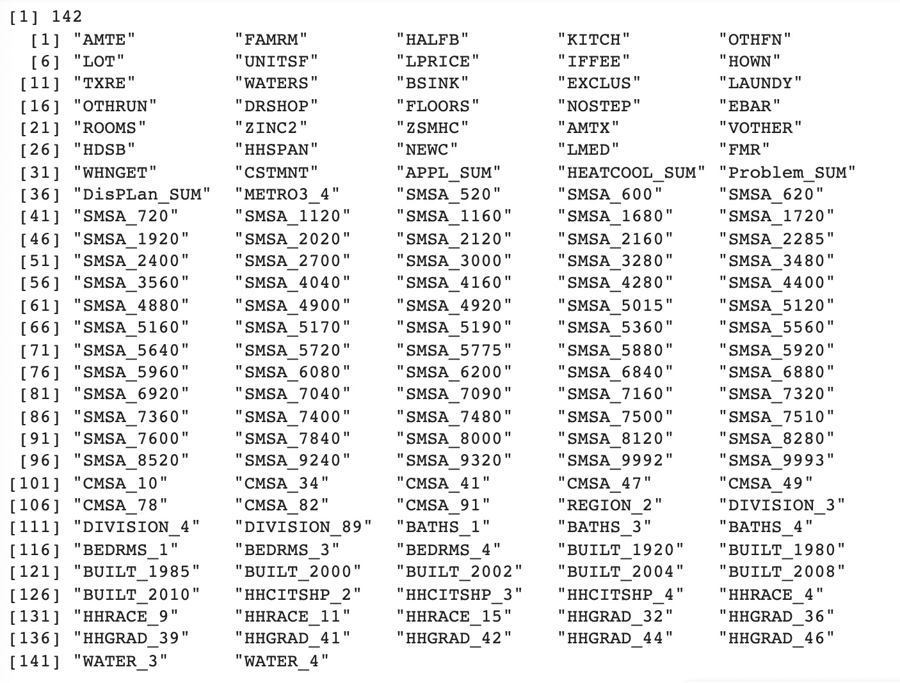
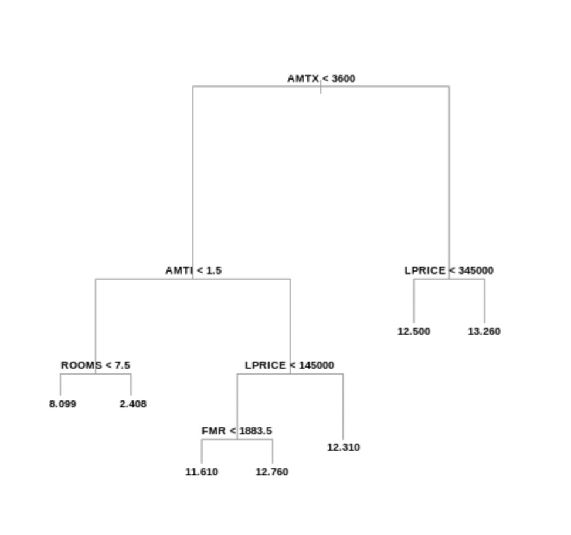
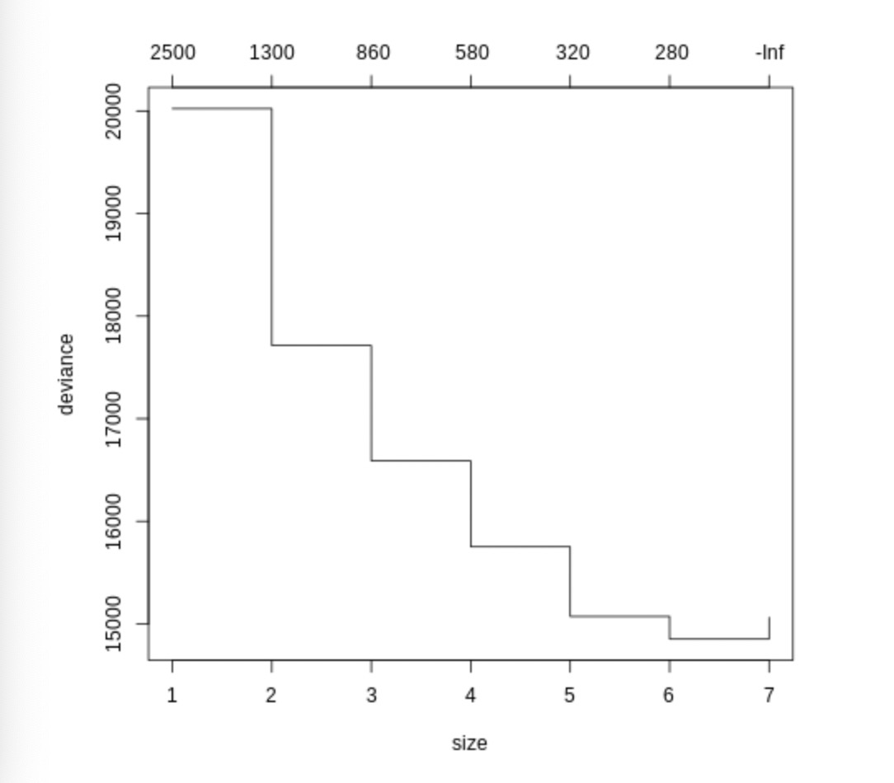
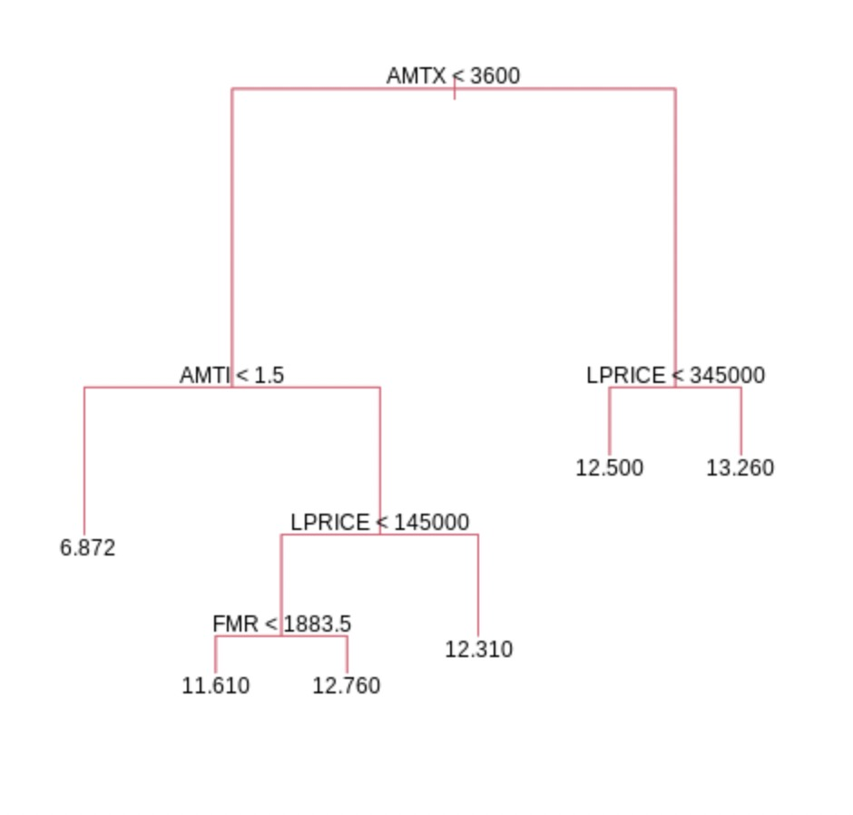
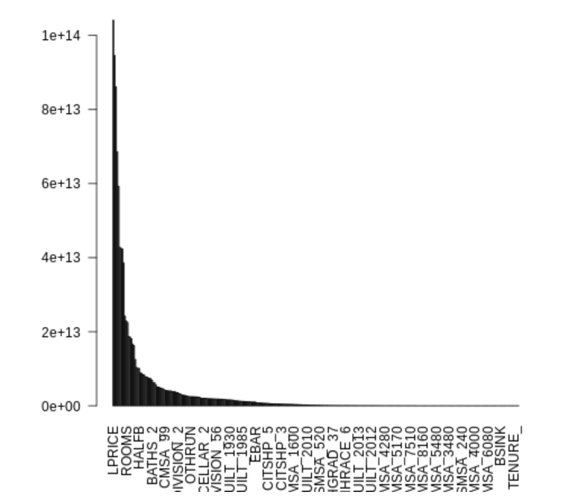
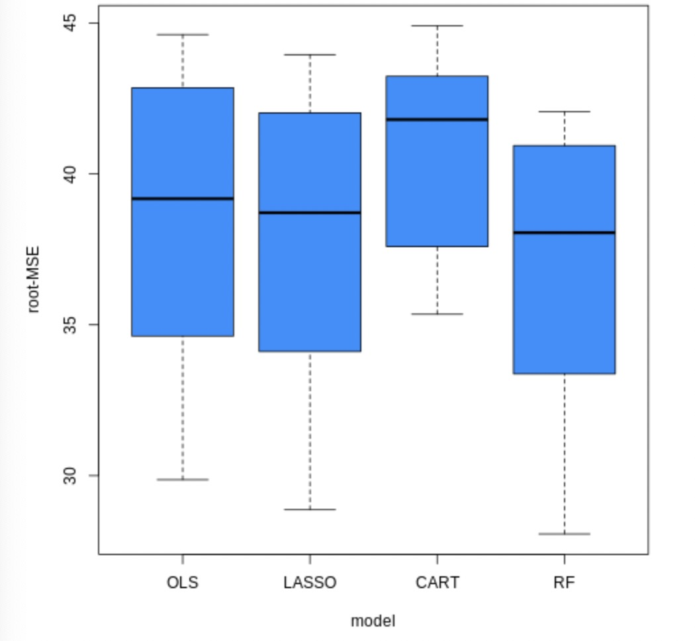
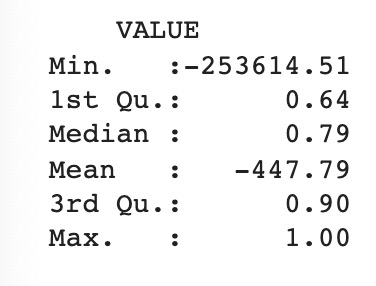

#460 Final:  An Applied Econometric Approach To Predict Housing Value

## Data 

This project collects the data from the American Housing Survey (AHS) 2013 Metropolitan dataset. The survey has been the most comprehensive national housing survey in the United States, which provides current information in various aspects related to house price, such as its size, composition and quality. The raw data amounts to 70044 observations and 2167 variables, including 145 census regions. This high dimensional data makes statistical computations challenging and this paper implements the following steps to handle missing observations and select the variables: Firstly, we consider all owner-occupied units (TENURE = 1, VACANCY = −6) with non-missing and positive value (VALUE > 0), which keep 35852 observations. Secondly, we conduct manual screening to select 173 out of 2167 variables that may be correlated with house prices, where we merge the dummy variables in the categories of Appliance, Heating & Cooling, Housing Problems and Disaster Planning into four aggregate variables. Thirdly, we remove the variables that have over 80% of missing values or non-applicable values, with 74 variables left. Lastly, we remove the observations that have missing values in any of the variables and reach our processed dataset with 20415 observations and 74 variables.

---

## Methodology

### Data Preprocessing and Method Introduction

This project uses a completely random sampling method to draw 9/10 of the overall sample as the training set and use the remaining 1/10 of the sample as the test set. Four methods are used to predict the training set separately, and then the test set is used for validation. The sampling was repeated 10 times, and the average Root of mean square error (RMSE) of each model for 10 times was calculated, and the model with the smallest RMSE was finally selected as the final prediction model according to the RMSE for comparison. Finally, using the best model to make prediction and calculate the predict accuracy.

### Ordinary least squares regression (OLS regression)

First, we get the dummy variables, and we get 310 features, such as AMTE (Average monthly cost of electricity), DENS (Number of dens or libraries in unit), DINING (Number of dining rooms in unit), FAMRM (Number of family rooms or great rooms in unit), etc. as the independent variable and VALUE (Current market value of residential unit and its yard) as the dependent variable, the out of sample mean square error of linear regression is 1836.477. The root mean square error of linear regression is 42.85414.

### LASSO regression:

By using cross-validation, the model shows that the best lambda is between -6 and -4. After selecting the best lambda and using the same variables, the LASSO model set 142 non-zero variables and shows that the minimum out-of-sample root mean square error is 42.79308.

### Regression Tree

After pruning the original tree, the model shows that 6 is the best size of the pruning tree, and the minimum out of sample root mean square error is 43.32149.

### Ramdom Forest

After conducting 200 bootstrap samples and choosing 5 as the size of nodes, the out of sample root mean square error of this model is 44.13945.

### Model Comparation

Box plot drawn based on the results of 10 random samples.

According to the root mean square error comparison, the model with the smallest mean square error of these 10 random samples is the Random Forest model. Although the one-time root mean square error comparison shows that the Random Forest model performs not better than other models, random pick-up samples' mean of 10 times shows that the Random Forest model performs best.

### Predict Result:

1/5 of the sample is used as the prediction dataset and the best model-random forest model is used to predict the value of this sample. This paper define the accuracy of the prediction model by using the formula:

accuracy = 1 – abs (predict value – true value)/true value.

Although some extreme prediction results will affect the average accuracy of the prediction sample, the accuracy of the 3/4 sample is higher than 0.64, and the accuracy of half sample is higher than 0.79, which shows that our model has a good performance in the prediction dataset.